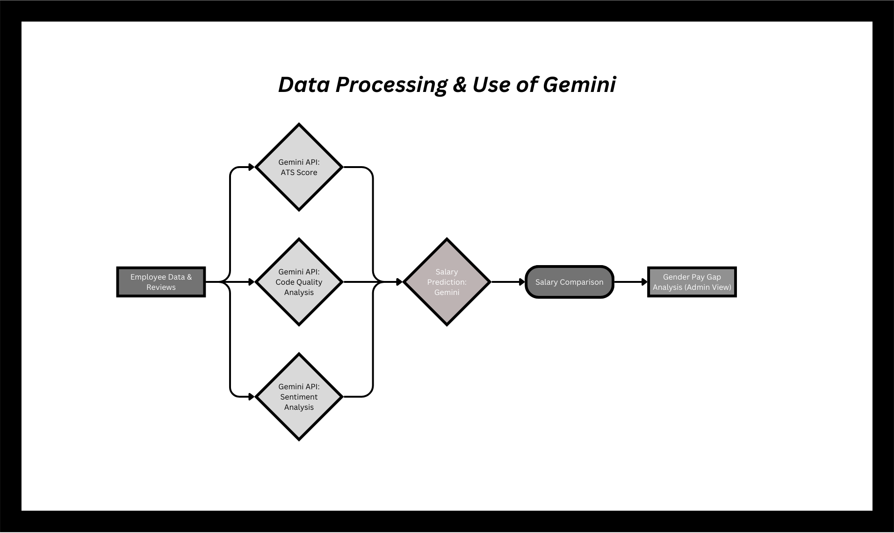
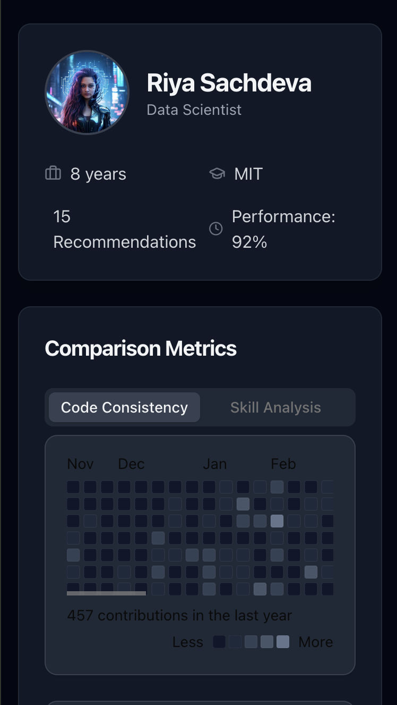
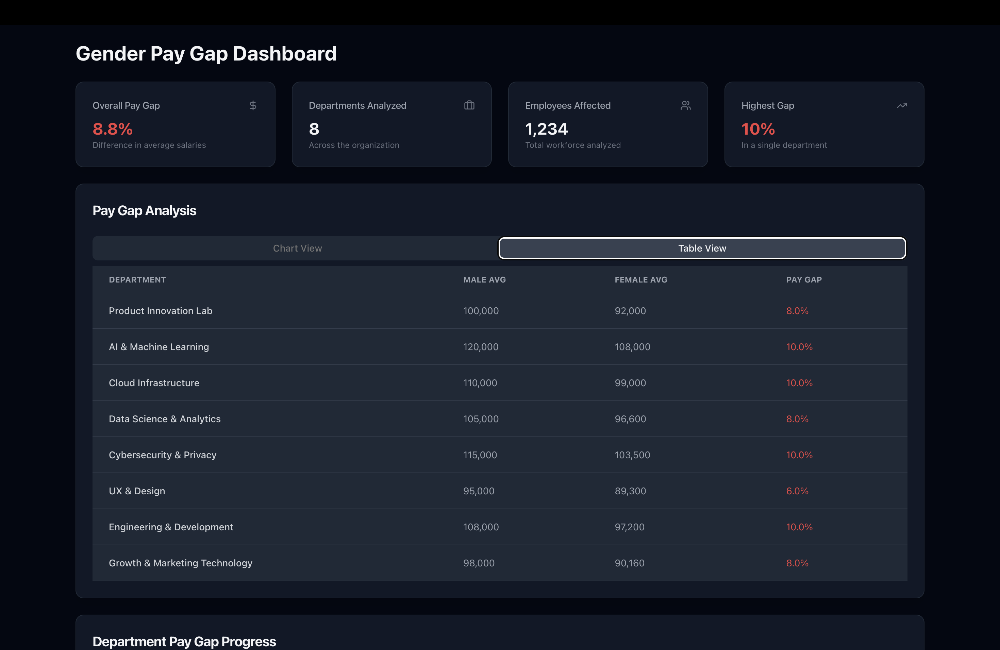
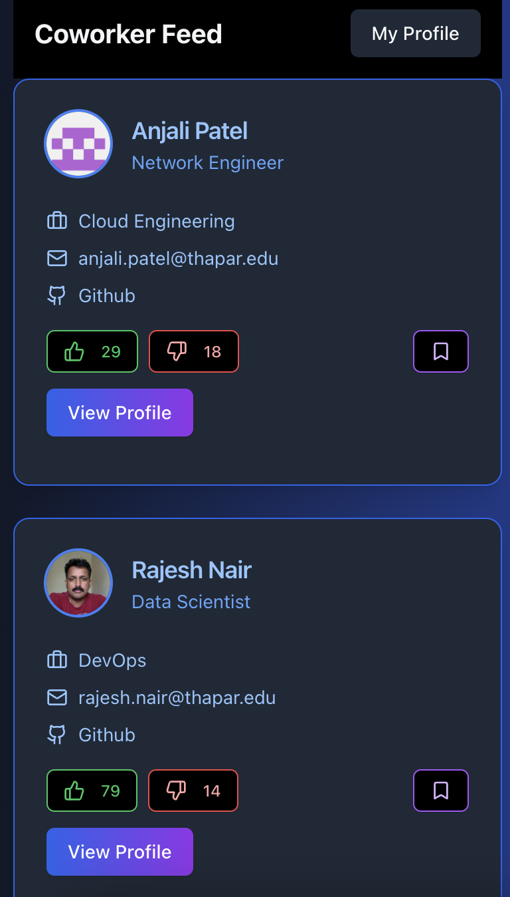

# Fair Cash

Welcome to **Fair Cash** — the app that’s transforming how companies identify and address gender-based salary disparities. Powered by AI,  and real-time employee feedback, Fair Cash uncovers hidden biases in your workplace, offering actionable insights to ensure fair pay and foster an inclusive culture. 

### 🚨 Why Fair Cash Matters
In many organizations, top executives are committed to avoiding sexism and ensuring positive CSR practices, but biases often sneak through at the middle management level. This is where promotion and pay decisions happen—and it’s where unconscious gender bias can unfairly impact women’s salaries and career growth. **Fair Cash** is here to change that.

It’s time for companies to gain clarity on their gender pay gaps and take action with data-driven insights. Let’s make pay equity not just a goal—but a reality.

---

### 🛠️ What Is Fair Cash?

Fair Cash uses cutting-edge tech to measure, predict, and analyze pay equity within your company. Here’s how it works:

- **Employee Onboarding**: Add your employees through an easy registration process, collecting vital information (salary, designation, work hours, GitHub profile, etc.).
- **Peer Feedback**: Using a fun, Tinder-style feed, employees review their colleagues, upvoting, downvoting, and providing qualitative feedback.
- **AI-Powered Analysis**:
  - **Resume & Code Quality Evaluation**: The Gemini 1.5 Flash API helps us assess resumes and code quality, giving a holistic view of employee performance.
  - **Sentiment Analysis**: Peer reviews are analyzed to uncover qualities like leadership, collaboration, and initiative.
  - **Salary Prediction**: Using machine learning, we predict a fair salary for each employee based on a variety of factors—market trends, experience, code quality, and more.
- **Disparity Report**: The app generates an insightful report that highlights pay gaps and discrepancies, empowering admins to take action.

---

### 🚀 How We Built It
Fair Cash is powered by a robust tech stack to deliver seamless performance:

- **Frontend**: Built with **Next.js**, creating a dynamic, interactive experience for employees and admins.
- **Database**: Managed using **Prisma** and **Postgres** for efficient and scalable data handling.
- **Machine Learning**: We used **Python** to build our predictive models, calculating fair salary estimates based on employee data and industry standards.
- **APIs**: Integrated **Gemini 1.5 Flash** for code and resume evaluation, and **GitHub API** to track contributions and code quality.

---

### ⚙️ Key Features
- **Intuitive Peer Reviews**: The peer review swiping interface encourages high participation and honest feedback.
- **Fair Salary Prediction**: A unique machine learning model that predicts salaries based on comprehensive data from resumes, code quality, experience, and peer reviews.
- **Actionable Reports**: Detailed reports for administrators highlighting pay gaps, bias, and specific areas for improvement.
---


### 🛠️ Installation

To run Fair Cash locally:

1. Clone the repo:
   ```bash
   git clone https://github.com/riyasachdeva04/faircash.git
   ```

2. Install dependencies:
   ```bash
   npm install
   ```

3. Set up environment variables for Prisma, Postgres, and API keys.

4. Run the development server:
   ```bash
   npm run dev
   ```

5. Open your browser and visit: `http://localhost:3000`

### 🧑‍💻 API Endpoints

#### Auth API:
- `api/auth` - Handles authentication.

#### Peer Feedback APIs:
- `api/streams/upvote/` - Upvote a colleague’s profile.
- `api/streams/downvote` - Downvote a colleague’s profile.
- `api/streams/bookmark` - Bookmark a colleague’s profile.

#### Machine Learning Pipeline:
- `-ml/ats` - Analyzes the ATS score of resumes.
- `-ml/commits` - Analyzes the quality of code commits.
- `-ml/sentiment-analysis-employee-review` - Analyzes sentiment in employee reviews.
- `-ml/salary` - Predicts the salary based on multiple factors.

---

### 💓 Acknowledgments

A huge thank you to:
- **Gemini 1.5 Flash** and **GitHub API** for providing powerful tools that made this project possible.
- Everyone working to make workplaces more inclusive and equitable for women and girls.






